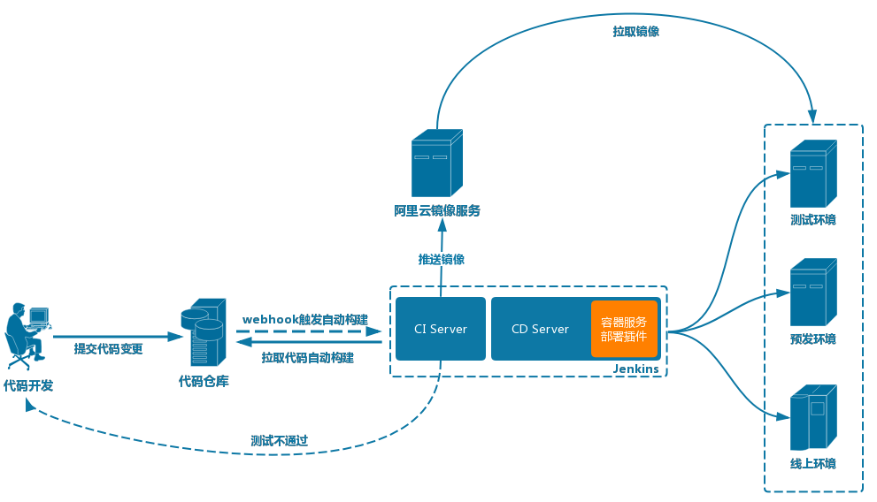

# 项目背景

在公司业务发展中，经过不断的迭代与发展，我们打造了以 Docker 为基础的架构体系。在服务公司的同时，也在不断的思考这样的体系能否为社区以及其他公司创造价值，这是促使我推进这个项目的初衷。在此，也希望能从社区得到更多的反馈，并不断的完善该项目。

容器化的优点基本已成为共识，这样的架构体系有什么优点呢？

它帮助我们更轻松的将应用于其运行环境打包，运维及架构可以将更多的精力用于应用/服务本身，而不需要再去关心其环境，从而从繁琐而重复的配置中解放出来。

于此同时，测试与部署变得更为方便，使得快速部署成为可能，也许在小规模部署中它的优势不是很明显，但就我们在应对突然流量的生产环境中的表现而言，横向扩容的能力非常优秀。

在上述的优点之上，业务流程更为简化，可以简单总结为下述三个阶段：

* 开发
* 构建
* 部署
  * 测试
  * 生产

**开发阶段**

容器可以有效帮助我们。举个简单的栗子，各种类型的数据库可以一键拉起，显而易见的是，容器的学习成本是远低于对各种运行环境的，即使不熟悉的同学也无需再花费时间去学习，能够更快速的投入业务开发阶段。类似数据库如 mysql、mongodb、redis 以及服务 kafka、rabbitmq 等，内网部署，团队开发与协作较为便捷。

**构建阶段**

可以综合使用 Jenkins、CircleCI、TravisCI、Drone 等多种方案进行镜像构建（项目构建与环境打包），从而使用镜像为基础，通过 公有镜像仓库如 Docker Hub、Aliyun Container Registry 与私有镜像仓库 Docker Registry、WMware Harbor、Aliyun Docker Registry 等进行托管，进而以应用/服务为最小单元进行后续操作。

> 注意常规的代码测试依然在该阶段进行。

**部署阶段**

凭借镜像仓库的 Webhook 以及预定义的部署模板（Docker Compose模板），通过规则过滤，可实现较为简单的自动化部署，进而解放运维人员。在此之上，我们使用通过添加 Hook 通过钉钉/微信等方式通知对应的测试人员、QA、项目经理，报备当前进展。

通过上述三个阶段的串联，我们实现了符合我们业务需求的 workflow，即 **开发人员推送代码到项目自动上线的自动化流程**。

 

**内容引用：**

* 图片：[http://www.infoq.com/cn/articles/CICDInCaaS-CreateCDSystem-part03](http://www.infoq.com/cn/articles/CICDInCaaS-CreateCDSystem-part03)（莫源）